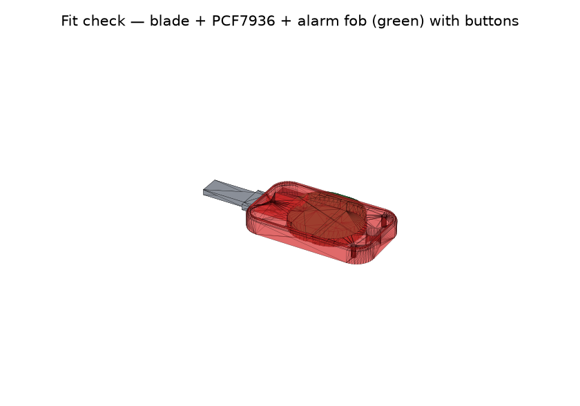
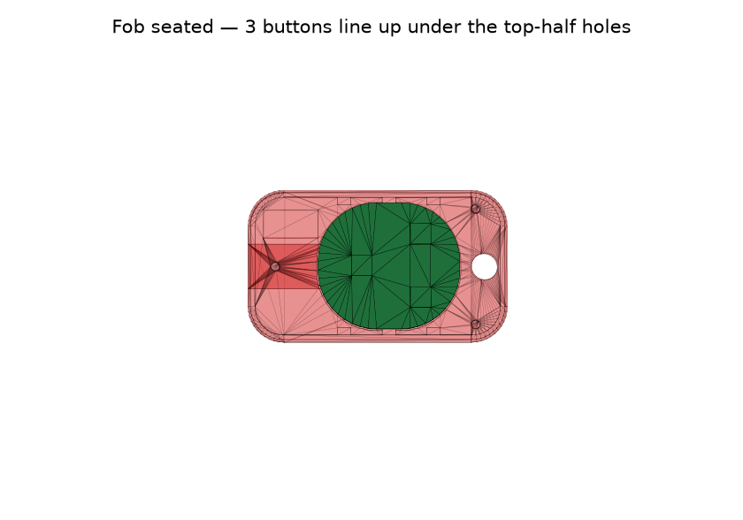

# Renault Logan key — parametric CAD model

A clean, printable **two-piece (clamshell) key head** for a Renault / Dacia
Logan, built **from scratch** as a parametric B-rep model in
[CadQuery](https://cadquery.readthedocs.io/) (OpenCASCADE kernel). Editing the
parameters at the top of the script reflows the whole part and re-exports
print-ready STLs.

|  |  |
|---|---|
|  |  |

> The gray blade, dark chip and green fob in the *fit-check* views are
> **reference geometry only** — they are not part of any printed STL.

Head envelope ≈ **58 × 34 × 12 mm** (auto-sized around the fob, with extra rear
body for the keyring hole).

## What it holds

1. **Alarm-remote fob** — a round PCB **31.5 × 28 mm, ~7 mm thick, 3 buttons on
   one face** — drops into a rounded **cavity** that fills the middle and rear
   of the head. **Retainer ribs** on the cavity walls grip its edge so it can't
   rattle or spin. Three **rectangular button openings** through the **top** half
   sit over the buttons — the caps drop into them and are pressed with the lid
   closed. Insert the fob with the shell open, then close the lid.

2. **Blade inserts from the front, like the OEM key, and holds without the
   second half.** The flat metal **tang** slides into a slot in the solid front
   of the **bottom** half; the wider **shoulder** butts the front face as the
   depth stop. Floor + a thin **cap** + side walls capture the tang, and a
   **bolt** through the tang's factory hole locks pull-out (and clamps the two
   halves at the front). The slot runs **through into the fob cavity** (10 mm
   wide), so it is a passage — print supports push straight out into the
   interior instead of being trapped in a blind pocket.

3. **Immobilizer** — the **PCF7936 / "ID46"** transponder sits in a small
   **open-topped nest** in the solid front, right next to the blade: walled on
   all four sides, open only at the parting plane so you drop it in with the
   shell open. A **hold-down pad on the lid** then presses on it, so once the key
   is closed the chip is trapped and **cannot fall out**.

4. **Keyring hole** — a plain hole through the extra solid body behind the fob
   (the body is simply longer; no protruding loop). Two back-corner assembly
   screws and an alignment lip/groove close the clamshell.

Because the enlarged front of the head is solid, the blade dock / chip nest /
keyring / bolt are just pockets cut into it — no separate printed bosses.

## Files

```
cad/renault_logan_key.py     the parametric model (edit this)
cad/render_previews.py       regenerates docs/renders/*.png from the STLs
export/bottom_shell.stl      print-ready, flat-side down          (+ .step)
export/top_shell.stl         print-ready, flat-side down          (+ .step)
export/key_assembled.stl     both halves fused (visual check)     (+ .step)
docs/renders/*.png           preview images
requirements.txt             cadquery + render deps
```

Both shell STLs are clean, watertight 2-manifold solids (verified: 0 boundary
edges, 0 non-manifold junctions) and print **flat-side down with no supports**.

## How the blade is held (cross-sections)

```
 side view (Y=0)                       top view (blade height)
 +--------- cap -----------+           front face
 |####  +- tang slot ------|--> into    |  +- 10 mm slot ---------|--> fob
 |####  |   BLADE ---->    | fob cavity  |  |  (through)          | cavity
 |#### bolt  +------------ |             |  +--------------------- |
 |####  # solid / thread # |  shoulder --+<-- butts the front face (depth stop)
 +-- floor ----------------+           bolt hole (o)  through the tang
```

Front insertion: the tang slides in until the **shoulder hits the front
face**. The **bolt** drops through the tang's hole into the solid front and
locks it against pulling back out.

## Build / export

```bash
pip install -r requirements.txt

# export the three STLs into export/
python3 cad/renault_logan_key.py

# also write STEP files (for editing in other CAD)
python3 cad/renault_logan_key.py --step

# regenerate the preview PNGs
python3 cad/render_previews.py
```

## IMPORTANT — measure your own blank before printing

There is no verified physical Logan blank behind these numbers, so the
blade/shoulder dimensions are **estimates** for the Renault/Dacia
**NE73 / VA2 / VAC102** blade family and the PCF7936 nest is sized from the
common aftermarket "ID46" carrier. Clones vary. Put calipers on your actual
parts and update the `KeyParams` block at the top of
`cad/renault_logan_key.py`:

```python
fob_length, fob_width, fob_body_thickness    # your alarm fob PCB (31.5 x 28 x 7)
fob_button_height                            # how far the buttons stand proud
button_positions                             # (x, y) of each button in FOB-LOCAL mm
button_slot_l, button_slot_w                 # rectangular opening size  << CHECK THESE
blade_width, blade_thickness, blade_insert   # the tang that enters the head
shoulder_width, shoulder_length              # the external stop (width > blade_width)
bolt_offset                                  # must line up with the hole in YOUR tang
chip_length, chip_width, chip_thickness      # your PCF7936 carrier
clearance                                    # loosen/tighten every pocket at once
```

`button_positions` came from the supplied photos and **must be verified** against
your board — they set where the top-half holes land. The head envelope
(`head_length/width/height`) is chosen to wrap the fob; if you change the fob
size, bump these to keep ~2 mm of wall around it.

## Printing notes

- Print both halves **flat-side down** as exported — each is a simple open
  tray, no supports.
- Hardware: 2 back-corner self-tapping screws + 1 blade bolt at the front
  (which also clamps the halves). Defaults sized for **M2.5 self-tap**:
  ~2.0 mm pilot in the bottom, 2.7 mm clearance + counterbore in the top —
  change the `asm_*` / `blade_*` parameters for your screws.
- Drop the **fob** into its cavity and the **chip** into its nest in the printed
  **bottom** half, check the blade tang slides in and the buttons line up under
  the top-half holes, then close the lid. Adjust `clearance` / `fob_clearance`
  if anything is too tight or too loose, and confirm `bolt_offset` lines up with
  the hole in your tang.
