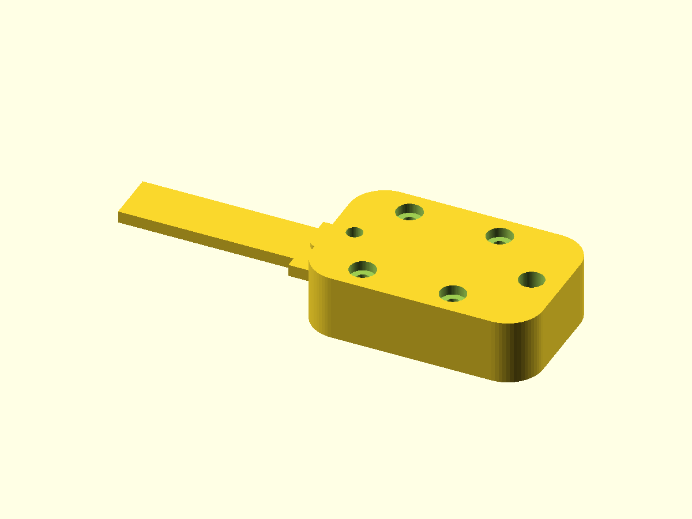
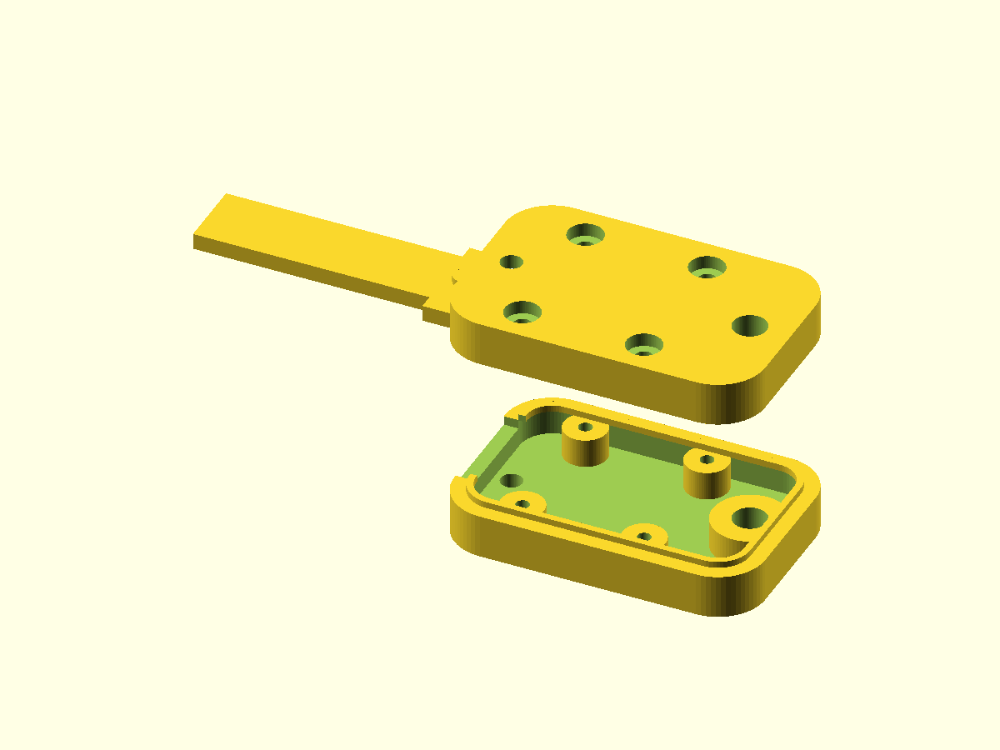
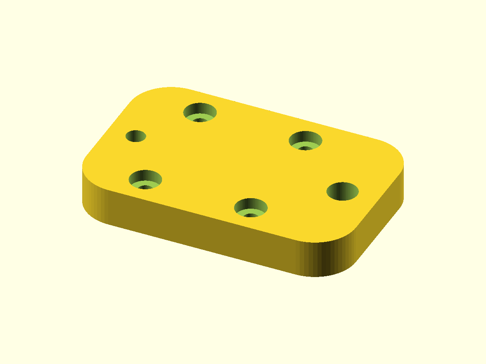
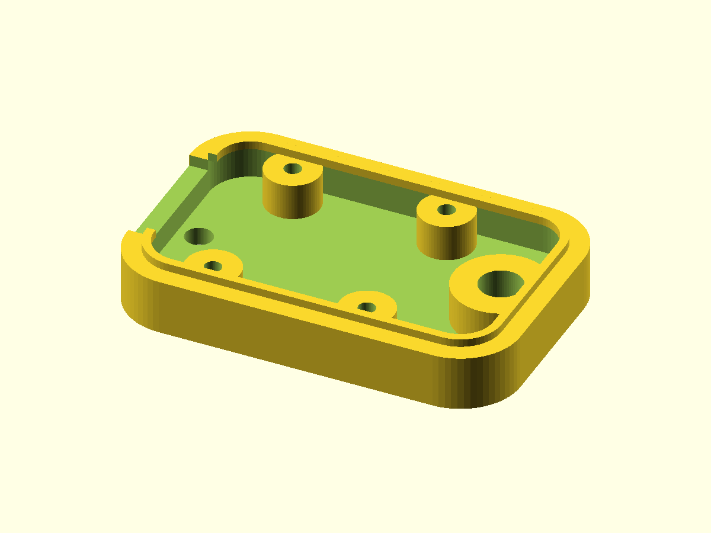

# Renault Logan key — parametric shell (Phase 1)

Parametric OpenSCAD model for a custom, 3D-printable key head that:

- accepts the original mechanical **key blade** (with its factory shoulder),
  transplanted from the OEM head, and
- accepts the **immobilizer transponder** capsule (glass ID46 chip, e.g.
  PCF7946/PCF7947).

Phase 2 (not implemented yet) will add an internal cavity sized for a
**Pharaon V16i** alarm remote ("teardrop" style fob) inside the same shell.

## Status: Phase 1 only

This phase delivers the blade + immobilizer shell. The general hollow
interior is intentionally generous so Phase 2 can add the alarm-remote
cavity later without reworking the outer shell.

## Files

```
cad/renault_logan_key.scad   parametric OpenSCAD source (this is the model)
export/top_shell.stl         phase-1 STL export, top half
export/bottom_shell.stl      phase-1 STL export, bottom half
docs/renders/*.png           preview renders (see below)
```

|  |  |
|---|---|
|  |  |

## Design overview

- The head is split into a **top and bottom shell**, joined along a
  horizontal parting plane at mid-thickness with 4 self-tapping screws
  through printed bosses, plus an alignment lip around the rim.
- Building each half independently (rather than boolean-cutting a shared
  solid) keeps the STL geometry a clean 2-manifold — no repair needed.
- The blade enters through a slot in the front face. The slot has two
  sections: a narrow channel sized to the blade, and — just behind it — a
  wider pocket sized to the factory **shoulder**, which is wider than the
  blade and forms a mechanical retention step (the blade can't be pulled
  back out). An optional printed pin passes through the shoulder's factory
  hole for extra retention.
- The immobilizer capsule sits in the hollow interior, in a channel
  centered on the parting plane.
- A keyring hole (with a reinforced boss) sits near the back of the head.

## IMPORTANT — measure your own key before printing

The repo does not have a verified physical Logan blank to measure, so the
blade/shoulder/transponder dimensions in the "MEASURE YOUR OWN PART"
section at the top of `renault_logan_key.scad` are **estimates** for the
Renault/Dacia **NE73 / VA2 / VAC102** blade family and **PCF7946/47 ("ID46")**
glass transponders — cross-referenced from locksmith blank catalogs, not
confirmed against a real Logan key. Use calipers on your actual blade,
shoulder, and transponder capsule and update these values before printing
a final part:

```openscad
blade_length, blade_width, blade_thickness
shoulder_length, shoulder_width, shoulder_thickness
use_shoulder_pin, shoulder_pin_dia, shoulder_pin_offset
immobilizer_dia, immobilizer_length
```

Everything else (shell envelope, wall thickness, screw bosses, keyring,
alignment lip) is derived from these and from the independent "Head shell
envelope" parameters further down, so changing the measurements above
reflows through the whole model automatically.

## Rendering / exporting

Requires [OpenSCAD](https://openscad.org/) (developed against 2021.01).

```bash
# open the interactive viewer (shows the closed assembly + reference blade/chip)
openscad cad/renault_logan_key.scad

# export STLs for printing
openscad -o export/top_shell.stl    -D 'render_mode="top"'    cad/renault_logan_key.scad
openscad -o export/bottom_shell.stl -D 'render_mode="bottom"' cad/renault_logan_key.scad
```

`render_mode` (top-of-file variable, overridable with `-D`) selects what
gets rendered:

- `"assembly"` — both shells assembled + reference blade/transponder (visual check only)
- `"assembly_open"` — same, pulled apart along Z
- `"top"` / `"bottom"` — a single printable shell half
- `"blade_reference"` — just the reference blade/shoulder solid

The silver/gray blade and dark transponder capsule shown in the assembly
views are **reference geometry only** (for checking fit) — they are not
part of either STL export.

## Printing notes

- Print both halves with the parting face down (flat on the bed) — each
  half is a simple open tray, no supports needed.
- Assembly hardware: 4x self-tapping screws sized for a ~2.0mm pilot hole
  in the bottom half and a ~2.6mm clearance hole + counterbore in the top
  half (M2.5 self-tap assumed by default — adjust `screw_*` parameters for
  your hardware).
- Fit-check the blade and transponder in the printed bottom half before
  gluing/screwing anything permanently; adjust `fit_clearance` if too tight
  or too loose.

## Next step (Phase 2)

Add a cavity sized for the Pharaon V16i alarm remote inside the existing
hollow interior, without changing the outer shell envelope.
